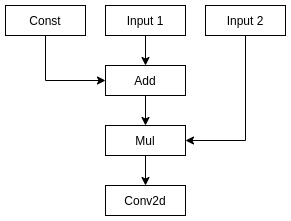
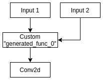

# Codegen

## Overview

`codegen` component is responsible for native code generation from graph representation.

Package provides utility `native_compiler` that takes neural network in circle format and compiles parts of the models into native code.
It's output is another circle model and library containing implementations for compiled parts.

Main module of `native_compiler` utility is `luci_codegen` library.

## Build

If you are using default build process, just run:

```
$ cmake <path to infra/codegen dir>
$ make -j$(nproc) native_compiler
```

This will download official Halide release automatically and build native_compiler using it.

Proceed with `detailed build` if you want to try your own Halide build.

### Detailed Build

Codegen needs external `Halide` build. If `Halide` is built from sources it demands `LLVM`.

To get needed components and build `native_compiler` executable on linux you can use following instruction.
Also see README.md in Halide repo for more methods to build LLVM and Halide (including windows build).

##### LLVM Build

Tested on commit **24faa87075ac1b4e4d7f7336271b1ba72ffcc2c0** from Jan 12 (master branch)

```
$ git clone https://github.com/llvm/llvm-project.git
$ cd llvm-project
# mkdir build; cd build
$ cmake -DCMAKE_BUILD_TYPE=Release \
        -DCMAKE_INSTALL_PREFIX=../install \
        -DLLVM_ENABLE_PROJECTS="clang;lld;clang-tools-extra" \
        -DLLVM_TARGETS_TO_BUILD="X86;ARM;NVPTX;AArch64;Mips;Hexagon" \
        -DLLVM_ENABLE_TERMINFO=OFF -DLLVM_ENABLE_ASSERTIONS=ON \
        -DLLVM_ENABLE_EH=ON -DLLVM_ENABLE_RTTI=ON -DLLVM_BUILD_32_BITS=OFF \
        ../llvm
$ make -j$(nproc)
$ make install
$ export LLVM_DIR=${PWD}../install/lib/cmake/llvm

```

##### Halide build

Tested on commit **890a5199ae8ade759de076217670ae980bf44823** Dec 23.

If you did not export variable from previous LLVM build you can pass it via cmake argument: `-DLLVM_DIR=<path to llvm cmake config>` 

```
$ git clone https://github.com/halide/Halide.git
$ cd Halide
$ mkdir build; cd build
$ cmake -DCMAKE_BUILD_TYPE=Release \
        -DCMAKE_INSTALL_PREFIX=../install \
        ../
$ make -j$(nproc)
$ make install
$ export Halide_DIR=${PWD}/../install/lib/cmake/Halide
```

##### Codegen build

Assuming current dir is where build should be done.
If `LLVM_DIR` and `Halide_DIR` variables are not set you can pass them as cmake arguments.

```
$ cmake <path to codegen CMakeLists.txt dir>
$ make -j$(nproc) native_compiler
```

`native_compiler` executable path is `<build dir>/codegen/luci-codegen/src/native_compiler`

`luci_codegen` library path is `<build dir>/codegen/luci-codegen/src/luci_codegen.so`

## Usage

##### native_compiler

`luci_codegen` uses Halide autoschedulers, they are built along with main Halide library (libHalide.so on linux)
and distributed as shared libraries:
- `libautoschedule_adams2019.so`
- `libautoschedule_li2018.so`
- `libautoschedule_mullapudi2016.so`

In order to use `native_compiler` utility `LD_LIBRARY_PATH` variable should be set, so these libraries are in path. For example: `$ export LD_PRELOAD_PATH=${Halide_DIR}/../../`.

Basic usage:

```
$ ./native_compiler model.circle compiled
```

As a result there will be created new directory `compiled` where compiler will place all generated files.

This includes:

- `model.circle`: circle model with "compiled" operators replacing parts of graph
- `generated_subgraph_XX.o`: Halide generated code
- `generated_subgraph_XX.h`: Halide generated header that describes interfaces of generated code
- `generated_subgraph_XX.cpp`: Wrappers around Halide generated code. Needed to break dependencies between Halide and runtimes (see section Wrappers for more info)

`generated_subgraph_*` files should be compiled in library and distributed along with `compiled.circle` model.

##### luci_codegen

This is library, and it has simple interface, see `include/Codegen.h` for details.
Common usage looks like:
```c++
  std::unique_ptr<luci::Module> luci_module = get_luci_module_somehow();

// First need to set parameters for compilation.
// These parameters have default values, so it is optional
// By default code will be compiled for host architecture
  luci_codegen::CodegenOptions options;
  options.max_inline_buffer_threshold = 1024;
  options.arch.type = luci_codegen::ArchType::Native;
  options.arch.last_level_cache_size = 512*1024;
  options.debug = false;
  options.os = luci_codegen::OS::Native;
  options.scheduler = luci_codegen::SchedulerAlgorithm::Adams;

// Create codegen object
  luci_codegen::Codegen codegen(options);

// Process graph
  codegen.process_module(*luci_module);

// Emit object files, headers and needed support libraries
// output_package_path should represent path to existing directory
  codegen.emit_code(output_package_path);

```

Note that this code will transform `luci_module` structure, it should be saved separately.

## Wrappers

Wrappers provides simple portable interface to generated code.

Related structures and methods of this interface are the following:

```c++
using CompiledFuncWrapper = int (*)(char *, void **);

struct ConfiguredCompiledFunc
{
  CompiledFuncWrapper wrapper;
  char *configuration;
};

using ConstructorCompiledFunc = ConfiguredCompiledFunc (*)(int ranks[], int *dims[]);

using DestructorCompiledFunc = void (*)(ConfiguredCompiledFunc *func);
```

Let's take a look at example:

After processing graph contains compiled operator with name `generated_subgraph_0`.
This means generated library will contain functions `create_generated_subgraph_0` and `free_generated_subgraph_0`
of types `ConstructorCompiledFunc` and `DestructorCompiledFunc` respectively.

To run compiled operator:


```
  // First fill information about input and output tensor shapes
  // for example this compiled operator has:
  // - two inputs with shapes {1, 2} and {2, 3}
  // - one output with shape {3, 4, 5}
  // input and output buffers can be accessed from pointers input1_buf, input2_buf, output_buf

int ranks[] = {2, 2, 3};
int input1_dims[] = {1, 2};
int input2_dims[] = {2, 3};
int output_dims[] = {3, 4, 5};
int *dims[] = {input1_dims, input2_dims, output_dims};

  // this call allocates ConfiguredCompiledFunc::configuration array and initializes needed structures
ConfiguredCompiledFunc compiled_func = create_generated_subgraph_0(ranks, dims);

void *buffers[] = {input1_buf, input2_buf, output_buf};

  // actual computations
compiled_func.wrapper(compiled_func.configuration, buffers);

  // This call release resources and deallocates ConfiguredCompiledFunc::configuration array
  // Note that ConfiguredCompileFunc structure still exists, but is not valid anymore.
free_generated_subgraph_0(compiled_func);
```

##### Rationale

TBD

## Class diagram

TBD

## Examples

Original graph | Compiled graph
-------------- | --------------
 | 

## Limitations

TBD

