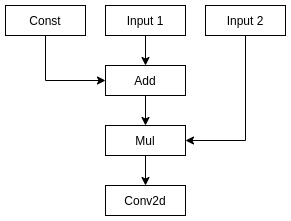
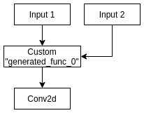

# luci-codegen

## Overview

`luci-codegen` component is responcible for native code generation from graph representation.

Package provides:
- Library `luci_codegen`: takes luci IR, replaces some nodes with special "Compiled" custom nodes.
- Executable `circle_codegen`: takes neural network in circle format, generates new circle model with compiled subgraphs. 

## Build

This component needs external modules for build:
- LLVM
- Halide

To build `luci_codegen`, `circle_codegen` and related components on linux you can use following instruction.
See README.md in Halide for more methods of LLVM and Halide builds (including windows build).

##### LLVM Build

Tested on commit **24faa87075ac1b4e4d7f7336271b1ba72ffcc2c0** from Jan 12 (master branch)

```
$ git clone https://github.com/llvm/llvm-project.git
$ cd llvm-project
# mkdir build; cd build
$ cmake -DCMAKE_BUILD_TYPE=Release \
        -DCMAKE_INSTALL_PREFIX=../install \
        -DLLVM_ENABLE_PROJECTS="clang;lld;clang-tools-extra" \
        -DLLVM_TARGETS_TO_BUILD="X86;ARM;NVPTX;AArch64;Mips;Hexagon" \
        -DLLVM_ENABLE_TERMINFO=OFF -DLLVM_ENABLE_ASSERTIONS=ON \
        -DLLVM_ENABLE_EH=ON -DLLVM_ENABLE_RTTI=ON -DLLVM_BUILD_32_BITS=OFF \
        ../llvm
$ make -j$(nproc)
$ make install
$ export LLVM_DIR=${PWD}../install/lib/cmake/llvm

```

##### Halide build

Tested on commit **890a5199ae8ade759de076217670ae980bf44823** Dec 23.

If you did not export variable from previous LLVM build you can pass it via cmake argument: `-DLLVM_DIR=<path to llvm cmake config>` 

```
$ git clone https://github.com/halide/Halide.git
$ cd Halide
$ mkdir build; cd build
$ cmake -DCMAKE_BUILD_TYPE=Release \
        -DCMAKE_INSTALL_PREFIX=../install \
        ../
$ make -j$(nproc)
$ make install
$ export Halide_DIR=${PWD}/../install/lib/cmake/Halide
```

##### luci-codegen build

Assuming current dir is where build should be done.
If `LLVM_DIR` and `Halide_DIR` variables are not set you can pass them as cmake arguments.

```
$ cmake <path to nncc CMakeLists.txt dir>
$ make -j$(nproc) circle_codegen
```

`circle_codegen` executable path is `<build dir>/compiler/luci-codegen/src/circle_codegen`

`luci_codegen` library path is `<build dir>/compiler/luci-codegen/src/luci_codegen.so`

## Usage

##### circle_codegen

`luci_codegen` uses Halide autoschedulers, they are built along with main Halide library (libHalide.so on linux)
and distributed as shared libraries:
- `libautoschedule_adams2019.so`
- `libautoschedule_li2018.so`
- `libautoschedule_mullapudi2016.so`

in order to use `circle_codegen` executable LD_LIBRARY_PATH variable should be set, so these libraries are in path. For example: `$ export LD_PRELOAD_PATH=${Halide_DIR}/../../`.

Basic usage:

```
$ ./circle_codegen model.circle compiled
```

As a result there will be generated `compiled.circle` models and set of generated_subgraph_X.o files with implementation of compiled subgraphs.
These object files should be compiled in library and distributed along with `compiled.circle` model.

##### luci_codegen

This is library, and it has simple interface, see `include/Codegen.h` for details.
Common usage looks like:
```c++
  std::unique_ptr<luci::Module> luci_module = get_luci_module_somehow();

// First need to set parameters for compilation.
// These parameters have default values, so it is optional
// By default code will be compiled for host architecture
  luci_codegen::CodegenOptions options;
  options.max_inline_buffer_threshold = 1024;
  options.arch.type = luci_codegen::ArchType::Native;
  options.arch.l1_size = 16*1024;
  options.debug = false;
  options.os = luci_codegen::OS::Native;
  options.scheduler = luci_codegen::SchedulerAlgorithm::Adams;

// Create codegen object
  luci_codegen::Codegen codegen(options);

// Process graph and emit compiled operators
  codegen.process_module(*luci_module);
  codegen.emit_code(output_package_name);

```

Note that this code will transform `luci_module`, it should be saved separately.

#Example

Original graph | Compiled graph
-------------- | --------------
 |  