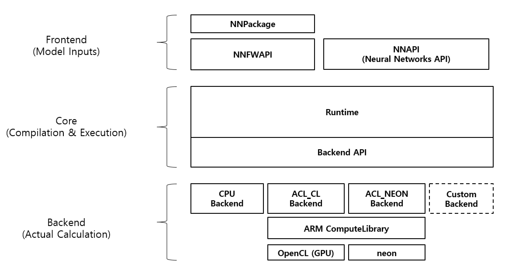

# API

## Runtime Layered Architecture

Here is a figure of runtime layered architecture.

There are three parts - Frontend, Core and Backend. Core works with Frontend and Backend API. Frontend gets user inputs(neural networks models) and Backend does the actual computation.

## Frontend API

Frontend API is about from creation/loading the model and

Runtime supports two (frontend) APIs - NN API and NNFW API.

### NN API

NN API stands for Android Neural Networks API. It is part of Android Open Source Project and we provide a binding between NN API and One Runtime.

For usage, refer to [Howto : NN API](../howto/how-to-use-nnapi-binding.md).

### NNFW API

NNFW API is ONE's own API. It supports loading models from NN Packages. As it is our own API, It can do most of functionalities that One Runtime offers. Representatively, it provides functions for execution with multiple backends.

For usage, refer to [Howto : NNFW API](../howto/how-to-use-nnfw-api.md).

## Backend API

Backend API is defined by One Runtime.

Backend API is about actual computation of operations and memory management for operands. In order to allow different kinds of computation units or computation libraries, One Runtime defines Backend API to support user defined operation kernels and memory manager. It contains a lot of C++ headers which are subject to change.

For detailed descriptions, refer to [Backend API](../runtime/backend-api.md).
