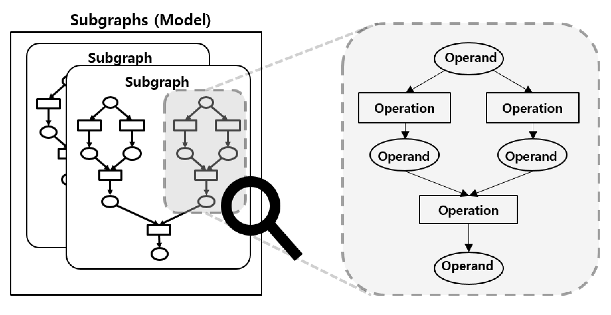

# Core

Runtime Core is a compilation/execution engine for neural network models.

## Modules

Runtime Core has four modules. These are namespaces as well as directory names in `/runtime/onert/core/src/`.

- `ir`  stands for Intermediate Representation which contains Neural Network Graph data structures
- `compiler` converts IR to an executable format
- `exec` is an execution module which is the result of a compilation
- `backend` is an interface for memory management for operands and actual calculation of operations

### Module `ir`

This module contains data structures of pure Neural Network models. The models from NN Packages or NN API are converted to these structures.

- `Subgraphs` is the entire neural network model which is a set of subgraphs
- `Subgraph` consists of operands and operations
- `Operand` (a.k.a. Tensor) has a shape, data type, data and references to operations
- `Operation` (a.k.a. Operator) has operation type, params, and references to operands

`Operand` and `Operation` are nodes of the graph, and the reference relationship between them is the edges of the graph.

`Subgraphs` represents the whole model. A model can have more than one `Subgraph` to support control flow operations. Those operations make calls to another subgraph and when the execution on another subgraph is done it gets back to previous subgraph execution with returned operands.

All graphs are a [DAG](https://en.wikipedia.org/wiki/Directed_acyclic_graph) so once model inputs are given we can run it in topological order.

Here's a figure of how those data structures are organized.

### Module `compiler`

`Compiler` is the main class of this module. Everything starts from it.

What it does is making models executable. It schedules execution order and assigns a backend for each operation. Here are major phases of compilation.

#### 1. Lowering

In Lowering, `Compiler` assigns a [backend](#module-`backend`) for each operation. It means that the operation will be run with the assigned backend's kernel.

There is a scheduler that allows the user to manually specify backends via compiler options. There is another scheduler that automatically assigns backends based on profile information measured in advance and saved.

#### 2. Tensor Registration

Each backend manages its tensors. In this phase, operand informations get registered to the corresponding backend. This will be used in generating tensor objects.

##### Q. What are the differences between 'operand' and 'tensor'?

In **ONE** runtime, 'operand' refers to an operand in a neural network model. While 'tensor' includes all 'operand' info plus actual execution info like actual buffer pointer. In short, 'operand' is for `ir`, 'tensor' is for `backend`.

#### 3. Linearization (Linear Executor Only)

Linearization means sorting operations in topological order. It saves execution time since it is not needed to resolve the next available operations after every operation at execution time.

It also makes plans for tensor memory. It can save some memory space by reusing other operands' space that does not overlap lifetime. All allocations are done at compile time (after [4. Kernel Generation](#4.-kernel-generation)) which saves execution time too.

#### 4. Kernel Generation

'kernel' here means an implementation of the actual calculation of an operation.

A backend is assigned for each operation. In this phase, a kernel for each operation is generated.

Let's say we have some functions written in a certain programming language. Then its compiler compiles each function into a chunk of assembly. Here 'function' is like 'operation' and 'assembly' is like 'kernel'.

#### 5. Create Executor

With generated tensors and kernels, the compiler creates executor objects. There are 3 types of executors: Linear, Dataflow, and Parallel. Linear executor is the default executor and Dataflow Executor and Parallel Executor are experimental.

For more about executors, please refer to the [Executors](executors.md) document.

### Module `exec`

`exec` stands for 'execution'. As a result of the compilation, `Execution` class is created. This class manages the actual execution of the model inference. Here is a typical usage of this class.

1. Resize input size if needed
2. Provide input and output buffers
3. Run the inference in either synchronous or asynchronous mode
4. Check out the results which are stored in output buffers provided earlier

### Module `backend`

Backends are plugins and they are loaded dynamically (via `dlopen`). So this module is a set of interface classes for backend implementation. `compiler` can compile with a variety of backends without knowing specific backend implementation.

Backend interface classes are mostly about memory management and kernel generation. For more, please refer to the [Backend API](backend-api.md) document.
