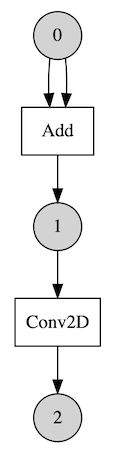
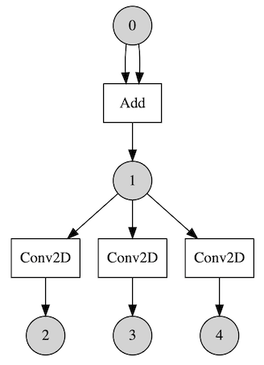
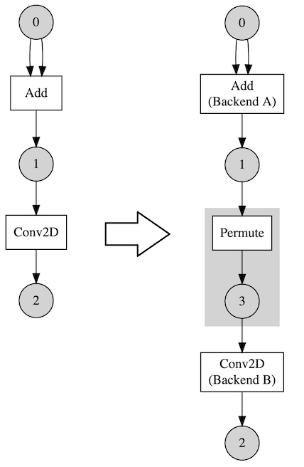

# Heterogeneous Execution

A major feature of ONE Runtime is that it can perform inference for a neural network model with different backends (computation libraries). This is called "Heterogenous Execution".

A neural network model consists of operations and each operation can be computed by a variety of backends. Then we can choose the faster one for a given computation. Let's say we have a model that has two operations in sequence.

And say we have two backends A and B. A has a faster kernel for Add and B has a faster kernel for Conv2D. Then it might be the best choice to run Add with A and run Conv2D with B.

Here is another case. Let's say we have a model that is not sequential so there are multiple operations can be run at the same time.

Say we have 3 backends that are based on CPU, GPU and NPU (Neural Processing Unit) respectively. After executing Add, 3 Conv2D operations are ready to run. We may utilize those backends with [Parallel Executor (experimental)](executors.md#parallel-executor-experimental). For this case we may get performance gain regardless of kernels' speed as those are run in parallel independently.

## Graph Transformation

Unfortunately, it is not that simple to get a performance gain. As each backend has its own memory management module, a copy must be done between backend boundaries. Plus, it may require layout changes so "Permute" operations are added from  `PermutationInsertionPass`. This process is done from the [Lowering](core.md#1-lowering) phase of compilation.

Here is an example of that. Let's say we have assigned different backends for Add and Conv2D. So a Permute operation is inserted between them.

This means that choosing a backend for an operation should be careful. We must take Permute(copy) overhead into account. That cost could dominate actual computation's so choosing the fastest one is not always the best choice.

Sometime later, we are going to introduce a concept of compatible backends and they can share their tensors freely. So for those cases, Permute operations are not inserted.

## Automatic Scheduling

Now we know that it could be useful to have a lot of backends, but one might wonder how we can schedule backends effectively. When a model is large, it is not trivial to do it manually by a user.

There is a [profiling-based automatic scheduler](/runtime/onert/core/src/compiler/HEScheduler.h) (experimental). It first runs every operation in sequence with every backend it has. And it records the duration of the execution for each. Then that data can be used to schedule. The scheduler assigns backends according to a certain algorithm with the given data. And the user can execute it with Parallel Scheduler.

There were actually some performance gain with the model Inception V3 and two backends - acl_neon(GPU) and acl_cl(GPU). Note that this model contains operations that can be run at the same time.
