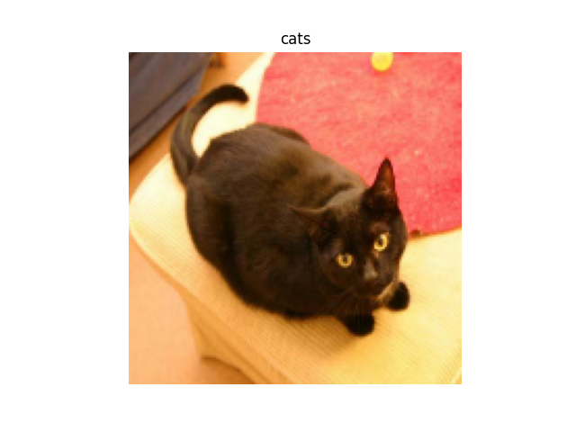

# Transfer Learning

Let's classify dogs and cats using the pre-trained model. It will be `mobilenet v2` in our case.

## Preparing dataset
The first step is conversion dataset (input data and expected outputs) to the binary format accepted by `ONE`. Note, that for many cases it can be achieved via [tf_dataset_converter](https://github.com/Samsung/ONE/tree/master/tools/generate_datafile/tf_dataset_converter).

```python
import os
import tensorflow as tf
import pathlib
import numpy as np

_URL = 'https://storage.googleapis.com/mledu-datasets/cats_and_dogs_filtered.zip'
path_to_zip = tf.keras.utils.get_file('cats_and_dogs.zip', origin=_URL, extract=True)
PATH = os.path.join(os.path.dirname(path_to_zip), 'cats_and_dogs_filtered')

train_dir = os.path.join(PATH, 'train')
validation_dir = os.path.join(PATH, 'validation')

BATCH_SIZE = 32
IMG_SIZE = (160, 160)

def label_to_array(label):
    arr = np.zeros(2, dtype=float)
    arr[label] = 1.
    tensor = tf.convert_to_tensor(arr, tf.float32)
    return tensor

train_dataset = tf.keras.preprocessing.image_dataset_from_directory(train_dir,
                                                            shuffle=True,
                                                            batch_size=BATCH_SIZE,
                                                            image_size=IMG_SIZE)

current_dir = pathlib.Path(__file__).parent
with open(current_dir/'cats_and_dogs.input.bin', 'wb') as in_stream:
    with open(current_dir/'cats_and_dogs.output.bin', 'wb') as out_stream:
        for image,label in train_dataset:
            in_stream.write(image.numpy().astype(np.float32).tobytes())
            out_stream.write(label.numpy().astype(np.float32).tobytes())
```

## Prepare model for fine-tuning
The first step to align the model to our problem is inserting custom operations on the top of the model. The base (with unchanged weights) remains the same.

```python
import tensorflow as tf
import numpy as np

BATCH_SIZE = 32
IMG_SIZE = (160, 160)
IMG_SHAPE = IMG_SIZE + (3,)

base_model = tf.keras.applications.MobileNetV2(input_shape=IMG_SHAPE,
                                               include_top=False,
                                               weights='imagenet')

base_model.trainable = False
image_batch = tf.zeros([32, 160, 160, 3])
feature_batch = base_model(image_batch)

# define custom classification layers
global_average_layer = tf.keras.layers.GlobalAveragePooling2D()
prediction_layer = tf.keras.layers.Dense(1, activation='relu')

# applying preprocessing
preprocess_input = tf.keras.applications.mobilenet_v2.preprocess_input

inputs = tf.keras.Input(shape=(160, 160, 3))
x = preprocess_input(inputs)
x = base_model(x, training=False)

# add additional layers on the top
x = global_average_layer(x)
outputs = prediction_layer(x)
model = tf.keras.Model(inputs, outputs)

# Convert to tflite
converter = tf.lite.TFLiteConverter.from_keras_model(model)
tflite_model = converter.convert()

# Save tflite model model.
with open('customized_mobilenetv2.tflite', 'wb') as f:
  f.write(tflite_model)
```
For more information about feature extraction and fine tuning, please refer to [transfer learning tutorial](https://www.tensorflow.org/tutorials/images/transfer_learning).

## Convert tflite model to circle model
In the moment of writing, the `circle+` format is developed but it will the other possibility to handle model training.
Note that `one-import` can be found in the installation directory (determined by `-DCMAKE_INSTALL_PREFIX` cmake flag which can be added to `./nnfw configure` command).
```bash
one-import tflite -i customized_mobilenetv2.tflite -o customized_mobilenetv2.circle
```

## Run training
Let's train the model using `onert_train`. In this case we want to test only 2 last layers: `Mean` and `FullyConnected` (created from `GlobalAveragePooling2D` and `Dense` in TensorFlow). Note that the other possibility is using `circle+` capabilities.
The crucial here is proper choosing value of `num_of_trainable_ops` to achieve tradeoff between training time and accuracy. It determines how many operations from the back of the graph will be trained. In our case, these are additionally added `Dense` with `Relu` activation, `GlobalAveragePooling` and some previous operations.

```bash
onert_train \
--epoch 5 \
--loss 1 \                # mean squared error
--loss_reduction_type 1 \ # sum over batch size
--optimizer 2 \           # adam
--learning_rate 0.0001 \
--batch_size 32 \
--num_of_trainable_ops 5 \
--load_expected:raw cats_and_dogs.output.bin \
--load_input:raw cats_and_dogs.input.bin \
--export_path customized_mobilenetv2_trained.circle \
customized_mobilenetv2.circle
```
The result of training:
```
Model Expected Filename cats_and_dogs.output.bin
Model Input Filename cats_and_dogs.input.bin
Model Filename customized_mobilenetv2.circle
== training parameter ==
- learning_rate        = 0.0001
- batch_size           = 32
- loss_info            = {loss = mean squared error, reduction = sum over batch size}
- optimizer            = adam
- num_of_trainable_ops = 10
========================
Epoch 1/5 - time: 532.378ms/step - loss: [0] 0.1567
Epoch 2/5 - time: 531.966ms/step - loss: [0] 0.0417
Epoch 3/5 - time: 532.795ms/step - loss: [0] 0.0104
Epoch 4/5 - time: 532.607ms/step - loss: [0] 0.0053
Epoch 5/5 - time: 532.567ms/step - loss: [0] 0.0049
===================================
MODEL_LOAD   takes 4.3720 ms
PREPARE      takes 192.9690 ms
EXECUTE      takes 165537.7600 ms
- Epoch 1      takes 33007.4380 ms
- Epoch 2      takes 32981.8970 ms
- Epoch 3      takes 33033.2690 ms
- Epoch 4      takes 33021.6380 ms
- Epoch 5      takes 33019.1300 ms
===================================
```
## Test inference
In this tutorial the inference will be launched via `Python API`.
### Convert the trained model to nnpackage format
The current version of `Python API` expect models in Python `nnpackge` format. The conversion can be done with `tools/nnpackage_tool/model2nnpkg/model2nnpkg.py` script.
```bash
python model2nnpkg.py -m customized_mobilenetv2_trained.circle -o mobilenet_package_dir
```
### Run inference via Python API
PRE: Install `nnfwapi` package
```
pip install -i https://test.pypi.org/simple/ nnfwapi==0.1.1
```
```python
from nnfwapi.libnnfw_api_pybind import *

import matplotlib.pyplot as plt
import os
import tensorflow as tf

nnpackage_path = '{mobilenet_package_dir}/customized_mobilenetv2_trained'
session = nnfw_session(nnpackage_path, 'cpu')

_URL = 'https://storage.googleapis.com/mledu-datasets/cats_and_dogs_filtered.zip'
path_to_zip = tf.keras.utils.get_file('cats_and_dogs.zip', origin=_URL, extract=True)
PATH = os.path.join(os.path.dirname(path_to_zip), 'cats_and_dogs_filtered')

validation_dir = os.path.join(PATH, 'validation')

BATCH_SIZE = 1 # we take only a single image per inference
IMG_SIZE = (160, 160)

validation_dataset = tf.keras.utils.image_dataset_from_directory(validation_dir,
                                                                 shuffle=True,
                                                                 batch_size=BATCH_SIZE,
                                                                 image_size=IMG_SIZE)

test_image,labels = next(x for x in validation_dataset)
test_image = test_image.numpy()
inputs = []
inputs.append(test_image)
input_size = session.input_size()

session.set_inputs(input_size, inputs)
outputs = session.inference()

# Note that the last layer of our model is Relu (which means "0" value for cats detection)
plt.title("dogs" if outputs[0] > 0.01 else "cats")
plt.axis("off")
plt.imshow(test_image.squeeze().astype("uint8"))
plt.savefig('transfer_learning_result.png')
```

Example output<br/>


## References
- [Transfer learning Tensorflow tutorial](https://www.tensorflow.org/tutorials/images/transfer_learning)
